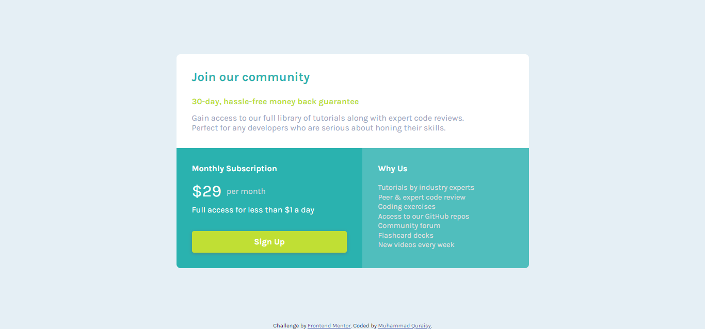

# Frontend Mentor - Single price grid component solution

This is a solution to the [Single price grid component challenge on Frontend Mentor](https://www.frontendmentor.io/challenges/single-price-grid-component-5ce41129d0ff452fec5abbbc). Frontend Mentor challenges help you improve your coding skills by building realistic projects.

## Table of contents

-   [Overview](#overview)
    -   [The challenge](#the-challenge)
    -   [Screenshot](#screenshot)
    -   [Links](#links)
-   [My process](#my-process)
    -   [Built with](#built-with)
    -   [What I learned](#what-i-learned)
    -   [Continued development](#continued-development)
    -   [Useful resources](#useful-resources)
-   [Author](#author)
-   [Acknowledgments](#acknowledgments)

**Note: Delete this note and update the table of contents based on what sections you keep.**

## Overview

### The challenge

Users should be able to:

-   View the optimal layout for the component depending on their device's screen size
-   See a hover state on desktop for the Sign Up call-to-action

### Screenshot

#### Desktop Preview

#### Mobile Preview

### Links

-   Solution URL: [Single Price Grid Repos](https://iyefreedy.github.com)
-   Live Site URL: [Single Price Grid](https://iyefreedy.github.io/single-price-grid)

## My process

### Built with

-   Semantic HTML5 markup
-   CSS custom properties
-   Flexbox
-   CSS Grid
-   Desktop-first workflow

### What I learned

How using grid on responsive website

## Author

-   Website - [Github](https://github.com/iyefreedy)
-   Frontend Mentor - [@iyefreedy](https://www.frontendmentor.io/profile/iyefreedy)
-   Twitter - [@iyefreed](https://www.twitter.com/iyefreed)
-   Instagram - [@iyefredickson](https://www.instagram.com/iyefredickson)

**Note: Delete this note and add/remove/edit lines above based on what links you'd like to share.**
